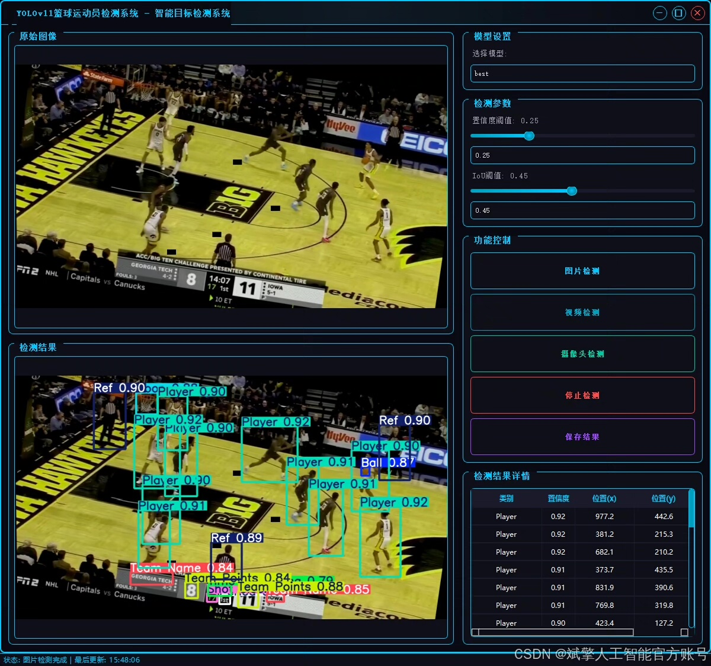
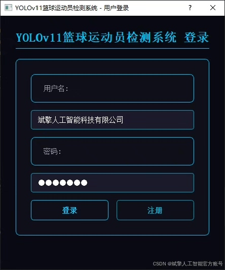
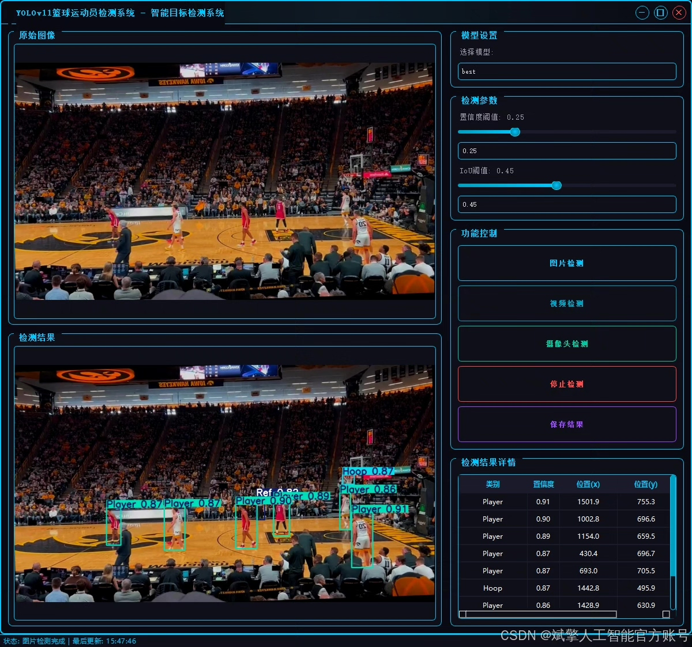
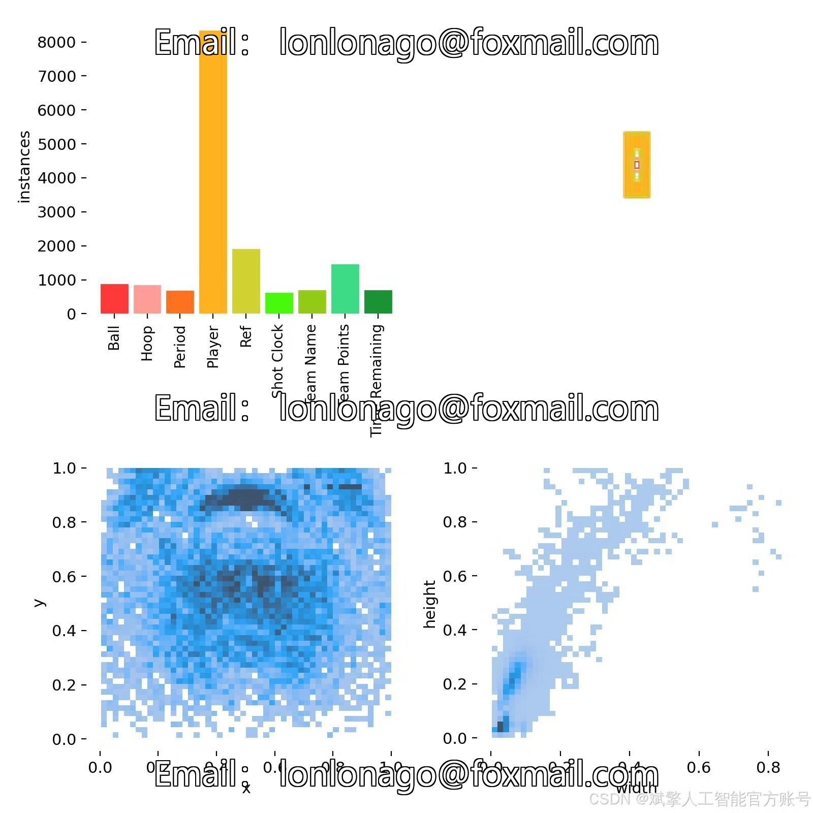
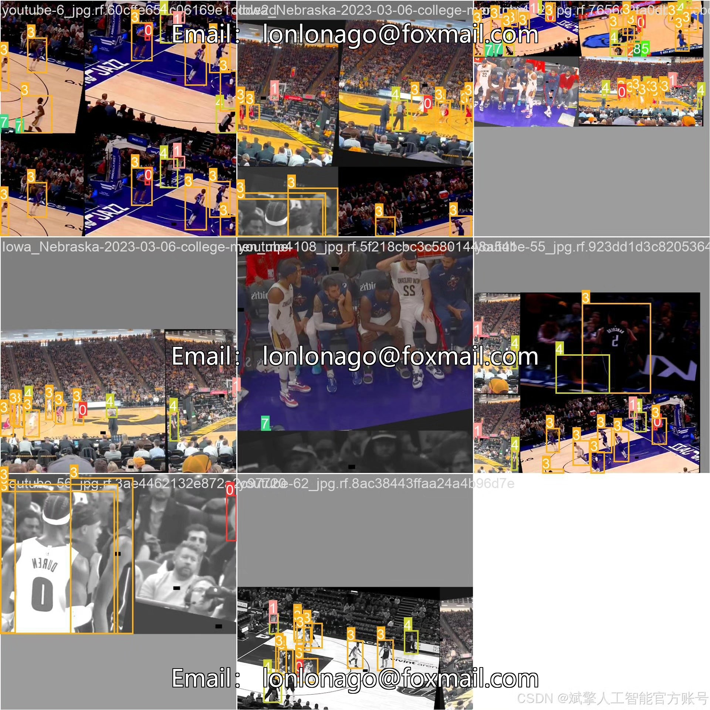
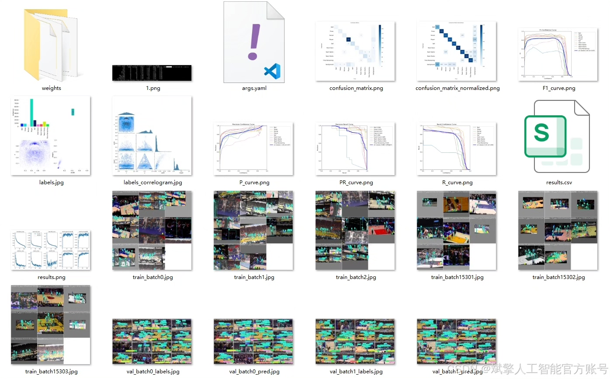
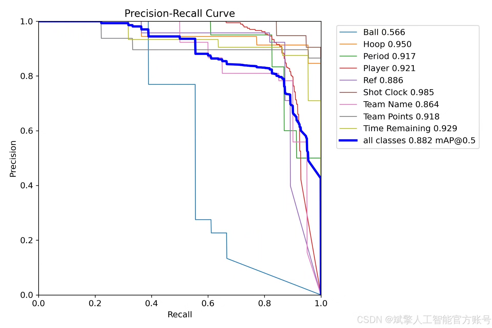
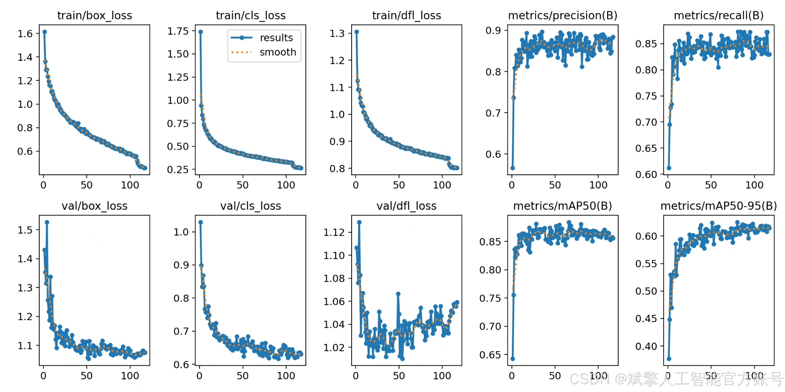
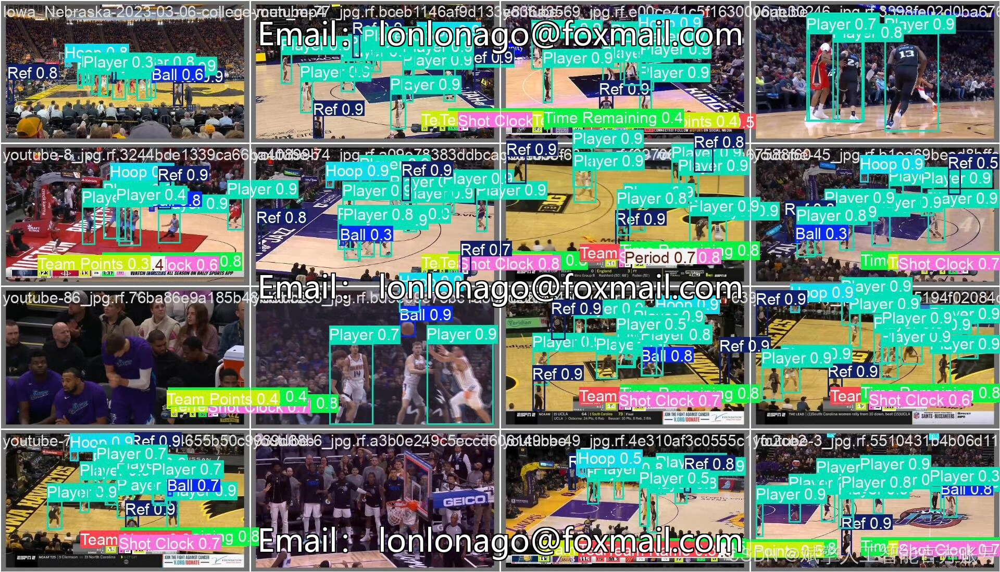

# YOLOv11 Basketball Athlete Recognition System Software Resources

## Body

YOLOv11 Basketball Athlete Recognition System Software Resources Based on Deep Learning YOLOv11: A basketball athlete recognition detection system (YOLOv11+YOLO dataset + UI interface + login registration interface + Python project source code + model)

This paper designs and implements a basketball athlete recognition detection system based on deep learning YOLOv11. The system can detect multiple types of targets in basketball game scenes in real time, including players (Player), referees (Ref), basketballs (Ball), hoops (Hoop), timers (Time Remaining), team names (Team Name), scores (Team Points), periods (Period), and offensive clocks (Shot Clock). The system uses the YOLOv11 algorithm for efficient target detection, combined with a custom labeled YOLO format dataset (1140 training images, 32 validation images, 24 test images). Through frameworks such as PyQt, it has built a user-friendly UI interface, integrating login registration functions.

Dataset:
nc: 9
names: ['Ball', 'Hoop', 'Period', 'Player', 'Ref', 'Shot Clock', 'Team Name', 'Team Points', 'Time Remaining'],
dataset quantity: 1140 training images, 32 validation images, 24 test images.

✅ User login registration: Supports password detection and security verification.
✅ Three detection modes: Based on the YOLOv11 model, supports image, video, and real-time camera detection, accurately recognizing targets.
✅ Dual-screen comparison: Display original images and detection results on the same screen.
✅ Data visualization: Real-time table displaying the category, confidence, and coordinates of detected targets.
✅ Intelligent parameter adjustment: Offers a confidence slide bar to dynamically optimize detection accuracy, adapting to different scene needs.
✅ Sci-fi style interactive interface: Dark theme paired with dynamic light effects, reducing visual fatigue and improving operational experience.

## Images

## Payment

Here is a pay link on Stripe ( https://buy.stripe.com/3cs8yP7sY87d0vu9AB ). Please contact me lonlonago@foxmail.com after funding $89, and I will send you a complete data files , thank you!

